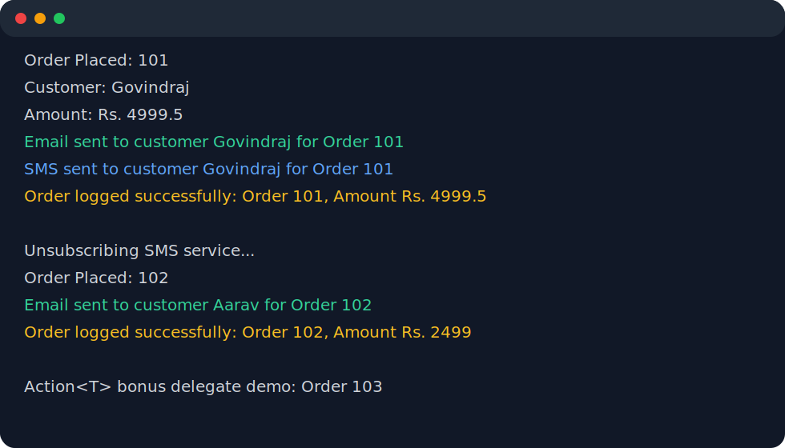

# Day 6 Practice Assignment - Real-Time Order Notification System

This console application demonstrates delegates, multicast delegates, events, and the publisher-subscriber model in C#.

## Problem Statement

Build a console-based order processing system for an e-commerce platform. When an order is placed, multiple independent modules should be notified without tightly coupling them to the order processor.

## Code Structure

```text
OrderApp
├── Program.cs
├── Order.cs
├── OrderPlacedHandler.cs
├── OrderProcessor.cs
├── Services
│   ├── EmailService.cs
│   ├── SMSService.cs
│   └── LoggerService.cs
```

## Features Implemented

| Requirement | Implementation |
| --- | --- |
| Delegate | `public delegate void OrderPlacedHandler(Order order);` |
| Event | `public event OrderPlacedHandler? OnOrderPlaced;` |
| Multicast delegate | Email, SMS, and Logger methods are subscribed to the same event. |
| Publisher | `OrderProcessor` publishes the order placed event. |
| Subscribers | `EmailService`, `SMSService`, and `LoggerService` react independently. |
| Dynamic unsubscribe | `SMSService` is removed before processing the second order. |
| Loose coupling | `OrderProcessor` does not directly depend on notification services. |
| Bonus | Uses `Action<Order>` and exception-safe event invocation. |

## Run Command

```bash
dotnet run --project Day6-PracticeAssignment/OrderApp/OrderApp.csproj
```

## Sample Output

```text
Order Placed: 101
Customer: Govindraj
Amount: Rs. 4999.5
Email sent to customer Govindraj for Order 101
SMS sent to customer Govindraj for Order 101
Order logged successfully: Order 101, Amount Rs. 4999.5

Unsubscribing SMS service...
Order Placed: 102
Customer: Aarav
Amount: Rs. 2499
Email sent to customer Aarav for Order 102
Order logged successfully: Order 102, Amount Rs. 2499

Action<T> bonus delegate demo:
Order Placed: 103
Action delegate notified admin for Order 103
```

## Sample Output Screenshot



## Self-Evaluation Checklist

| Checkpoint | Done |
| --- | --- |
| Delegate created | Yes |
| Multicast delegate working | Yes |
| Event implemented | Yes |
| Multiple subscribers added | Yes |
| Output matches expected | Yes |
| Code structured properly | Yes |
